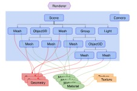
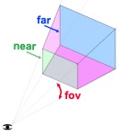

# threejs 与 webGl

threejs 是使用 webGL 来绘制三维效果的，webGL 只能画点、线、三角形，用 webGL 做三维效果很复杂。
threejs 封装了一系列功能，诸如场景、灯光、阴影、材质、贴图、空间运算等

# 基础概念

一个 threejs 应用，需要创建很多对象，并把它们关联起来，如下图：

- `renderer`渲染器，把`scene`场景和`camera`摄像机传入渲染器，渲染器会将摄像机视锥体中的三位场景渲染成一个二维图片显示在`canvas`画布上
- 一个场景中包含多个对象：
  - scene 场景
  - mesh 网格
    - 网格用特定的材质来绘制特定的几何体
      - `geometry`几何体，threejs 内置了多种几何体，也可以自定义几何体，或者从文件中加载几何体
      - `material`材质，材质代表被绘制的几何体的表面属性，如颜色、光亮程度，材质可以引用一个或多个纹理`texture`
        - `texture`纹理，通常表示一副图像，可以从文件中加载、在画布上生成、有另一个场景渲染出的图像
  - light 光源
  - group 群组
  - object3d 三维物体
  - camera 摄像机
    - 摄像机 camera 与其它对象不同的是，它不仅在场景图中起作用，在场景外也可以
    - 所有子对象的位置和方向，总是相对于父对象而言的
    - 下图展示了相机的视锥，通过 4 个参数定义，fov，near，far，aspect，near、far 表示近平面和远平面，在这两个外部的会被裁剪；近平面和远平面的高度由视野范围（fov）决定，宽度由视野范围和宽高比（aspect）决定：
    - 

# hello cube

- 看示例代码 [基础立方体](./examples/src/1.js)
