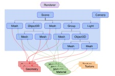
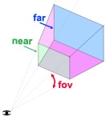

# threejs 与 webGl

threejs 是使用 webGL 来绘制三维效果的，webGL 只能画点、线、三角形，用 webGL 做三维效果很复杂。
threejs 封装了一系列功能，诸如场景、灯光、阴影、材质、贴图、空间运算等

# 基础概念

一个 threejs 应用，需要创建很多对象，并把它们关联起来，如下图：



- `renderer`渲染器，把`scene`场景和`camera`摄像机传入渲染器，渲染器会将摄像机视锥体中的三位场景渲染成一个二维图片显示在`canvas`画布上
- 一个场景中包含多个对象：
  - scene 场景
  - mesh 网格
    - 网格用特定的材质来绘制特定的几何体
      - `geometry`几何体，threejs 内置了多种几何体，也可以自定义几何体，或者从文件中加载几何体
      - `material`材质，材质代表被绘制的几何体的表面属性，如颜色、光亮程度，材质可以引用一个或多个纹理`texture`
        - `texture`纹理，通常表示一副图像，可以从文件中加载、在画布上生成、有另一个场景渲染出的图像
  - light 光源
  - group 群组
  - object3d 三维物体
  - camera 摄像机
    - 摄像机 camera 与其它对象不同的是，它不仅在场景图中起作用，在场景外也可以
    - 所有子对象的位置和方向，总是相对于父对象而言的
    - 下图展示了相机的视锥，通过 4 个参数定义，fov，near，far，aspect，near、far 表示近平面和远平面，在这两个外部的会被裁剪；近平面和远平面的高度由视野范围（fov）决定，宽度由视野范围和宽高比（aspect）决定：
    - 

# hello cube

- 看示例代码 [基础立方体](./examples/src/1-basic.js)

# create text

- 使用 CSS2DRenderer 或 CSS3DRenderer
- 在 canvas 中画文字，并把它用作 texture
- 创建 3D 文字模型，并导入 threejs
- 使用 TextGeometry 方法，根据 3D 字体和字符串输出文字
- Bitmap Fonts
- Troika Text

# drawing lines

- 看示例代码 [根据顶点画线段](./examples/src/1-basic.js)

# 销毁对象

销毁不需要的对象，释放内存，可以通过 renderer.info 获取当前内存中有多少已缓存的对象
Controls and renderers 被 dispose 后，不能再使用，必须再创建一个新的实例
For geometries, materials, textures, render targets and post processing，这些被 dispose 后，再使用的话，引擎会自动创建

- geometry.dispose()
- material.dispose()
- texture.dispose()
- imagebitmap.close()
- WebGLRenderTarget.dispose()
- Skeleton.dispose()

## 图元

threejs 有很多图元，就是一些 3D 形状，threejs 内置了很多 3D 形状，一般在学习或实验时使用
在应用中，常见做法是让美术在 3D 建模软件中创建 3D 模型，比如 Blender，Maya，Cinema 4D

### BufferGeometry

是面片、线或点几何体的有效表述。包括顶点位置，面片索引、法向量、颜色值、UV 坐标和自定义缓存属性值。使用 BufferGeometry 可以有效减少向 GPU 传输上述数据所需的开销。

- 索引 index

webgl 中，面由至少两个三角面片组成，一个立方体 6 个面，至少 12 个三角形。三角形有 3 个顶点描述，立方体的一个面有 6 个顶点，但是其中两个点是重复的，如果想要复用，可以设置 BufferGeometry 按照顶点索引绘制

- 组 group

通过 group，可以将几何体分割成组渲染，每个面片可以使用不同的材质渲染。每个 group 包含三个属性：

```js
{
    start: Integer,//当前组中几何体的第一个顶点索引
    count: Integer,//当前几何体包含多少顶点
    materialIndex: Integer,//材质索引
}
```

示例中展示了多种图元(几何体)：[图元](./examples/src/3-primitives.js)

## 场景图

场景图是一颗树，每个网格（mesh）相对于它的父计算位置和尺寸。
一个场景，设计场景图是基础
[太阳系场景图](./examples/src/4-scenegraph-solarSystem.js)

[坦克场景图](./examples/src/4-scenegraph-tank.js)
